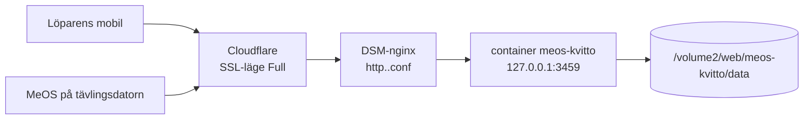

# Driftsättning på Synology-NAS bakom Cloudflare

Mall. Byt `<värdnamn>`, `<användare>` och `<nas-adress>` mot dina egna
värden — de hör hemma i din egen anteckning, inte i ett publikt repo.

Kedjan är **Cloudflare → DSM-nginx på NAS:en → containern**. Uppsättningen
följer mönstret från `ett befintligt värdnamn`: vhosten bor i projektet och
installeras till `/etc/nginx/conf.d/`.



Avläst på NAS:en, inte antaget:

| | |
| --- | --- |
| Värdport | **3459** (ledig; youmewe ligger på 3456) – sätts som `HOST_PORT` i `.env` |
| Origin-certifikat | `/etc/ssl/certs/nas-origin.pem`, SAN en SAN som täcker värdnamnet — självsignerat |
| Cloudflare SSL-läge | **Full**, aldrig *Full (strict)* — certifikatet är självsignerat |
| `client_max_body_size` | redan `0` globalt i DSM:s nginx; sätts ändå i vhosten |
| `TRUST_PROXY` | **2** — Cloudflare och nginx bygger båda på `X-Forwarded-For` |

## 1. DNS

`<värdnamn>` saknar post. Lägg till den i Cloudflare, proxad
(orange moln), som övriga värdnamn i zonen.

## 2. Lägg upp projektet

```bash
# från arbetskatalogen
git archive --format=tar HEAD | gzip > /tmp/meos-kvitto.tgz
scp -O /tmp/meos-kvitto.tgz <användare>@<nas-adress>:/volume2/web/
ssh <användare>@<nas-adress> '
  mkdir -p /volume2/web/meos-kvitto &&
  tar xzf /volume2/web/meos-kvitto.tgz -C /volume2/web/meos-kvitto'
```

## 3. Konfigurera och starta

```bash
ssh <användare>@<nas-adress>
cd /volume2/web/meos-kvitto
cp deploy/env.exempel .env      # fyll i MEOS_PASSWORD, MAILGUN_PWD och HOST_PORT
chmod 600 .env

# Synologys Docker skapar inte bind-monteringens katalog själv – utan den
# vägrar containern starta med "Bind mount failed".
mkdir -p data

DOCKER=/var/packages/ContainerManager/target/usr/bin/docker
$DOCKER compose up -d --build
curl -s localhost:3459/api/health
```

Tjänsten vägrar starta utan `MEOS_PASSWORD` — skrivändpunkterna ligger annars
öppna mot internet (KRAV-13).

Lösenordet behöver aldrig passera någon annanstans. Skapa det på NAS:en:

```bash
openssl rand -base64 24 | tr -d '/+=' | cut -c1-28
```

Läs det när det ska in i MeOS Onlineresultat:

```bash
grep '^MEOS_PASSWORD=' /volume2/web/meos-kvitto/.env | cut -d= -f2-
```

## 4. Installera vhosten

```bash
sudo cp deploy/http.VARDNAMN.conf.exempel /etc/nginx/conf.d/
sudo chmod 755 /etc/nginx/conf.d/http.<värdnamn>.conf
sudo nginx -t && sudo nginx -s reload
```

**Använd `nginx -s reload`, inte `synosystemctl restart nginx`.** Det senare går
via Synologys tjänstehanterare, hänger, och tar ner containrar på vägen — här
stoppades både `ntfy` och `meos-kvitto`, och med `restart: unless-stopped`
startade de inte om av sig själva. `-s reload` skickar SIGHUP direkt till nginx
master: inga avbrott, ingen kaskad.

`cp` kan lämna filen med läge `000`; nginx kör som root och läser den ändå, men
`nginx -t` som annan användare gör det inte. Därav `chmod`.

DSM kan skriva över egna filer i `/etc/nginx/conf.d/` vid större
uppdateringar — kör då det här steget igen.

## 5. Kontrollera — innan tävlingsdagen

```bash
tools/verifiera-drift.sh https://<värdnamn>
```

Nio kontroller: att tjänsten svarar, att data når disken, att
skrivändpunkterna kräver lösenord, att kvitton inte får cachas, att
proxyinställningen stämmer, och att kvitto och PDF fungerar.

**`TRUST_PROXY` ska inte gissas.** Tjänsten räknar hur många led som faktiskt
rapporteras i `X-Forwarded-For` och säger vad värdet borde vara:

```
✗ Proxyinställningen stämmer inte med hur anropen kommer in
    Anropen kommer via 2 proxyled men TRUST_PROXY är 1 – löparens adress blir
    då proxyns, gemensam för alla. Sätt TRUST_PROXY till 2.
```

Med fel värde räknas alla löpare som samma avsändare, och mejltaket låser ut
hela tävlingen efter fem utskick — utan att något annat ser fel ut. Samma
siffra finns i `/api/health` som `proxyhopp`.

## 6. MeOS på tävlingsdatorn

| | |
| --- | --- |
| Onlineresultat | `https://<värdnamn>/meos` |
| Resultatfiler | `https://<värdnamn>/iof` |
| Lösenord | samma som `MEOS_PASSWORD` |

## 7. Adressen i PM

Varje tävling har en egen adress (KRAV-18), att trycka i PM eller sätta som
QR-kod på arenan:

```
https://<värdnamn>/t/<tävlings-id>
```

Id:t är detsamma som du sätter i MeOS Onlineresultat. Adressen fungerar innan
tävlingen börjat — sidan säger då att inga resultat kommit än — så den kan
tryckas i förväg.

## 8. Uppdatera en driftsatt tjänst

Samma kedja som steg 2, följt av en ombyggnad:

```bash
git archive --format=tar HEAD | gzip > /tmp/meos-kvitto.tgz
scp -O /tmp/meos-kvitto.tgz <användare>@<nas-adress>:/volume2/web/
ssh <användare>@<nas-adress> '
  cd /volume2/web/meos-kvitto &&
  tar xzf /volume2/web/meos-kvitto.tgz -C . &&
  /var/packages/ContainerManager/target/usr/bin/docker compose up -d --build'
```

**Uppackningen skriver över allt som ligger i repot**, `docker-compose.yml`
inräknat. Därför får inga driftvärden redigeras in i de filerna — de hör
hemma i `.env`, som inte finns i repot och alltså ligger kvar. Det var
`HOST_PORT` som lärde oss det: värdporten stod förr i `docker-compose.yml`,
återställdes till 3000 vid varje deploy, och containern band då fel port
medan nginx pekade på den gamla. Utåt blev det 502, medan `docker ps` såg
fullt friskt ut.

`data/` ligger utanför repot och rörs inte — tävlingsdata överlever en
uppdatering. Kontrollera efteråt med `tools/verifiera-drift.sh`.

## Noterat vid driftsättningen

- **Containern kör som `root`**, så filerna den skriver i `data/` blir
  root-ägda även om katalogen ägs av dig. Det fungerar, men en backup som körs
  som annan användare kan behöva `sudo`.
- **Startloggen säger "Löpare når kvittosidan via arenans wifi på …"** och
  visar containerns interna adress. Raden kommer från reservspåret utan
  internet (KRAV-12, utgått) och är missvisande här. Kosmetiskt.

## Kvarstående, ditt beslut

- **Containern kör som `root`.** Rättningen kräver att datakatalogen ägs av
  rätt uid; en volym som slutar gå att skriva till på en tävlingsdag är värre
  än problemet. Se `docs/systemritning.md`.
- **Läsgränsen är en bromskloss, inte en mur.** `READ_LIMIT=1000` olika löpare
  per klient och kvart.
