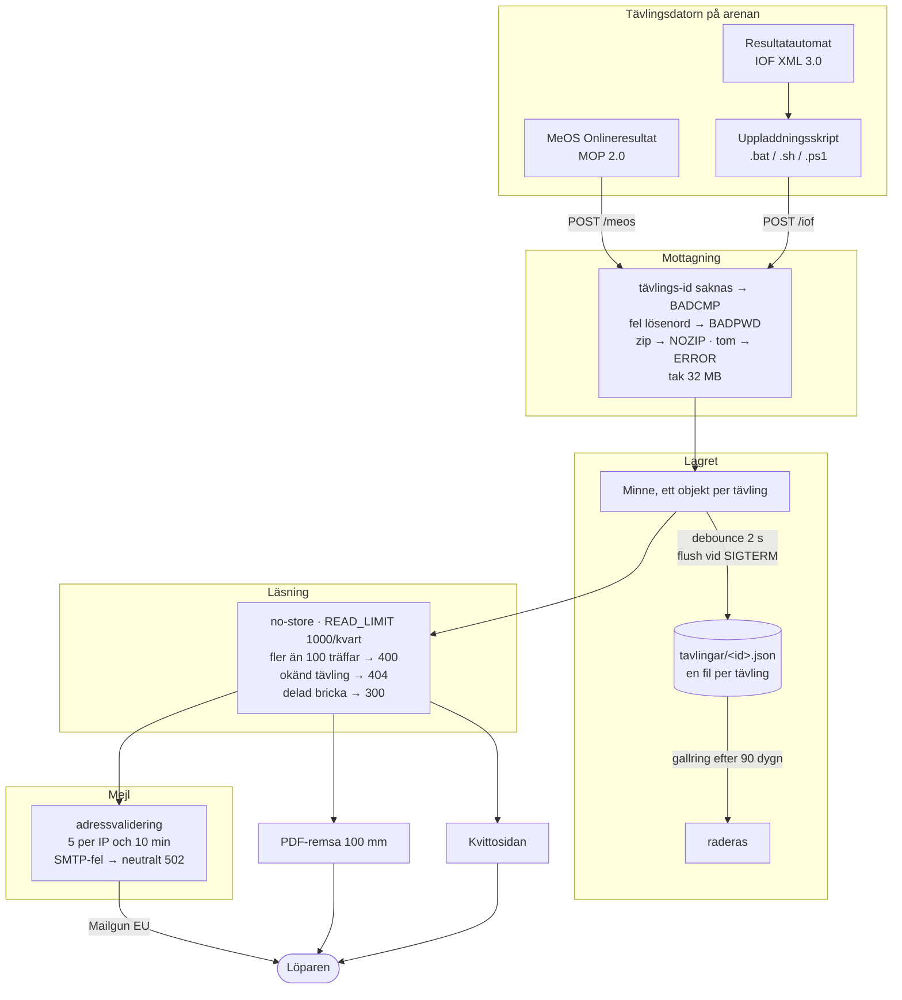
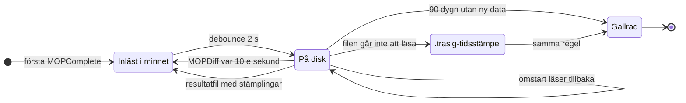
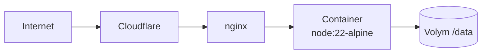

# Systemritning

Två oberoende inflöden av tävlingsdata slås ihop till ett kvitto som löparen når
på mobildata. Den här ritningen följer datans väg och sätter varje skydd där det
verkar. Under varje skydd står vad som händer *utan* det — det är den meningen
som motiverar att det finns.

Kraven själva står i [`KRAV.md`](KRAV.md); här är hur de hänger ihop.

## Helheten

Bricknumret används för uppslag men lämnar aldrig tjänsten (KRAV-5).

## Skydden, steg för steg

### På tävlingsdatorn — KRAV-11

| # | Skydd | Utan det |
| --- | --- | --- |
| 1 | Filen räknas som uppladdad först vid `OK` | Ett `BADPWD` eller `ERROR` kommer som ett vanligt svar, inte som ett undantag. Uppladdningen tystnar efter första felet — resten av tävlingen. |
| 2 | Tvingad omladdning var 30:e cykel | Ändringsdetektorn bygger på tidsstämpel och storlek och kan missa en ändring. |
| 3 | Alla tre varianterna följs åt | `.bat` och `.ps1` går bara att provköra på Windows; ett test läser skripttexten så att en fix inte stannar i en av dem. |

### Mottagning — `POST /meos`, `POST /iof`

| # | Skydd | Utan det |
| --- | --- | --- |
| 4 | Tävlings-id måste vara satt | Svar `BADCMP`. Samma statuskoder som MeOS referensimplementation, alltid ren text. |
| 5 | Lösenord krävs — och tjänsten vägrar starta utan | Skrivändpunkterna ligger öppna mot internet. Vem som helst kan ersätta hela tävlingen med en `MOPComplete` mitt under loppet. `ALLOW_NO_PASSWORD=1` för eget nät utan internet. |
| 6 | Zip avvisas före tolkning | `NOZIP` får MeOS att skicka om okomprimerat. Kroppen tolkas aldrig. |
| 7 | Tak 32 MB, rå kropp | Ligger nginx framför krävs `client_max_body_size 32m`, annars 413 mitt i tävlingen. |

### Lagret — KRAV-2, KRAV-8, KRAV-14

| # | Skydd | Utan det |
| --- | --- | --- |
| 8 | Sparning via tmp + rename | Ett avbrott mitt i skrivningen lämnar den gamla filen hel i stället för en halv ny. |
| 9 | `flush()` vid SIGTERM och SIGINT | Sparningen är debouncad och håller inte processen vid liv. Det som väntade försvann vid varje deploy — under loppet läker det av sig självt, efter dagens sista sändning inte. |
| 10 | Oläsbar fil läggs undan, skrivs aldrig över | Sparas som `.trasig-<tidsstämpel>` så att innehållet går att rädda för hand. Med en fil per tävling kostar den bara sin egen tävling, inte alla nittio dagarna. |
| 11 | Gallring efter `RETENTION_DAYS` | Vid start och en gång per dygn. Undanlagda filer gallras likadant — de innehåller hela deltagarfältet. En tävling som inte går att åldersbestämma tidsstämplas när den upptäcks, annars låg den kvar för alltid. |
| 12 | Stämplingar överlever `MOPComplete` | MeOS skickar en komplett sändning varje gång Onlineresultat startas om. Stämplingarna kommer från resultatfilen och ägs inte av onlineprotokollet. |
| 13 | Ofullständiga resultatfiler varnas det om | Fel datum på filen, och löpare utan namn. IOF XML 3.0 har namnet som obligatoriskt och MeOS skriver det alltid — saknas det är något fel uppströms, och kvittot går inte att känna igen. |
| 14 | Dubblettvarning och `sparfel` i hälsokontrollen | Två tävlings-id för samma tävling räknar placeringen på fel underlag. Ett sparfel märks annars först vid omstarten, när allt är borta. |

### Läsning — `GET /api/*`

| # | Skydd | Utan det |
| --- | --- | --- |
| 15 | `Cache-Control: no-store` | Kvitton är personuppgifter, och ett cachat svar visar gammal status med en ålder som ser färsk ut — varningen som skulle fånga det är det första som slutar fungera. |
| 16 | Tak för antal **olika** löpare per klient | `READ_LIMIT`, standard 1000 per kvart. Räknar personer och inte anrop, så en kvittosida som uppdaterar sig kostar 1 hur länge den än står öppen. |
| 17 | Bricknumret lämnar aldrig tjänsten | Det ingår inte i en vanlig resultatlista, följer samma person år efter år och är den nyckel som annars knyter ihop en löpare mellan tävlingar. Sökning på numret fungerar ändå. |
| 18 | Okänd tävling faller inte tillbaka | Löpar-id är MeOS interna och återanvänds. En sparad länk till en gallrad tävling visade annars en främmande människas kvitto. |
| 19 | Delad bricka gissar inte | Svar 300 med en valbar lista. |
| 20 | Bred sökning avvisas | Fler än 100 träffar ger 400 — en lista med tusentals hjälper ingen att hitta sig själv. |

### Mejlutskick — `POST /api/receipt/email`

| # | Skydd | Utan det |
| --- | --- | --- |
| 21 | Tak per avsändar-IP | 5 per 10 minuter. Kräver att `TRUST_PROXY` är satt bakom proxy, annars räknas proxyns adress för alla och fem utskick låser hela tävlingen ute. |
| 22 | Tjänsten upptäcker en proxy den inte vet om | Kommer anropen med `X-Forwarded-For` utan att `TRUST_PROXY` är satt loggas det en gång och syns i `/api/health`. |
| 23 | SMTP-fel läcker aldrig ut | Neutralt 502 till klienten; leverantörens text loggas med maskerade adresser, eftersom loggen lever kvar långt efter att tävlingsdatan gallrats. |
| 24 | Saknad konfiguration är avstängd, inte trasig | Svar 503, och kvittosidan visar inte formuläret. |

### Kvittosidan i mobilen — KRAV-17

| # | Skydd | Utan det |
| --- | --- | --- |
| 25 | All fritext escapas, id kodas i länkar | Namn och tävlingsnamn kommer utifrån och får aldrig bli körbar markup på den sida varenda löpare öppnar. |
| 26 | Inga externa resurser | Inga CDN:er, inga externa typsnitt — de skulle läcka vilka löpare som öppnar sina kvitton. |
| 27 | Uppdateringen schemaläggs om först när svaret kommit | Ett intervall hade lagt en ny begäran ovanpå den förra så snart servern tog längre än 15 sekunder — flest anrop precis när servern har det svårast. |
| 28 | Den upphör när kvittot inte kan ändras | Slutar vid fastställt resultat och vid 404; fortsätter vid serverfel och vid glapp i täckningen. |
| 29 | 25 sekunders tidsgräns per anrop | Utan den ser ett glapp i mobilnätet ut som att sidan hängt sig. |
| 30 | Varning när underlaget står stilla | Slutar MeOS skicka fryser kvittot. Efter 10 minuter säger sidan ifrån, med åldern räknad på servern. |
| 31 | Mejlformuläret rivs inte under pågående utskick | Adress och besked överlever en omritning, annars skrevs svaret till noder som inte längre satt på sidan. |

### Driftsättningen — KRAV-13

| # | Skydd | Utan det |
| --- | --- | --- |
| 32 | Byggkontexten är en vitlista | Bara det tjänsten kör kommer med. En skarp resultatfil i arbetskatalogen bakades annars in i imagen och följde med dit den driftsätts. |
| 33 | Tidszon med `tzdata` | Alpine ignorerar annars `TZ` tyst, och kvittots "Uppdaterat" visar en tid före målgången. |
| 34 | Driftkontrollen körs dagen före | `tools/verifiera-drift.sh` prövar utifrån att tjänsten svarar, att data når disken, att skrivändpunkterna kräver lösenord, att kvitton inte får cachas, att proxyinställningen stämmer och att kvitto och PDF fungerar. |

## Datans livscykel

Åldern räknas från senast mottagna data, med tävlingsdatumet som reserv.

## Kedjan ut till internet

Varje led kräver att `TRUST_PROXY` sätts till antalet hopp.

## De tre artefakterna

Sida, PDF och mejl underhålls var för sig och glider isär om ingenting håller ihop
dem. Ett test hämtar fältlistan ur kvittosidans egen mall och kräver att allt den
visar också finns i PDF:en.

| Artefakt | Format | Bevakas av |
| --- | --- | --- |
| Kvittosidan | Vitt papper, svart text, monospace — oavsett sidans färger | kontrast, träffytor, escapning |
| PDF-remsan | 100 mm bred, 45 tecken, höjden växer med innehållet, Courier + WinAnsi | paritet mot sidan, radbredd |
| Mejlet | PDF som bilaga, sammanfattning i texten | preliminärmärkning, lagtid |

## Vad som medvetet inte skyddas

En ritning som bara visar skydden ljuger. Det här är kvar, och är kvar av skäl.

**Resultaten är offentliga.** Namn, klubb, klass, tider och sträcktider är publika i
sporten. Läsgränsen är en bromskloss mot massinsamling, inte en mur: en klient
kommer åt 1000 kvitton per kvart i stället för hela fältet på ett par sekunder.

**Containern kör som `root`.** Rättningen kräver att `/data` ägs av rätt uid. En
volym som slutar gå att skriva till på en tävlingsdag är värre än problemet, så
ändringen är inte gjord.

**Ett tak per IP träffar trubbigt.** Mobiloperatörer lägger många abonnenter bakom
samma adress. Därför räknar läsgränsen personer och inte anrop, och är satt högt —
ett snävt tak hade låst ute en hel operatör mitt under tävlingen.
